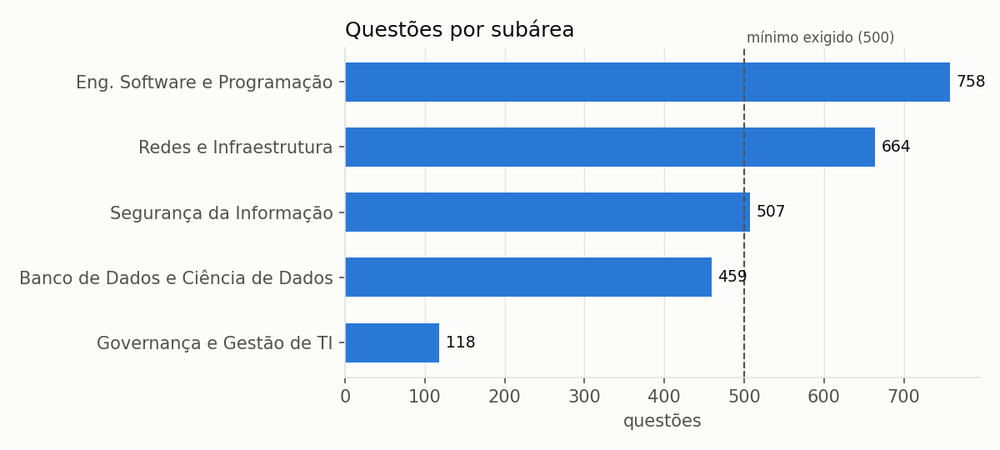
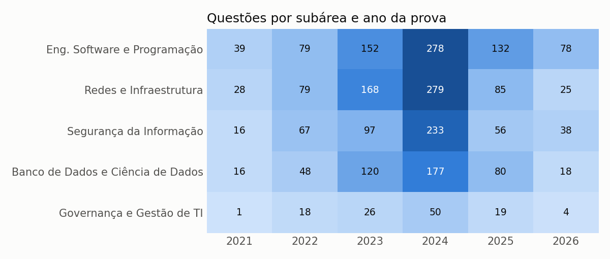
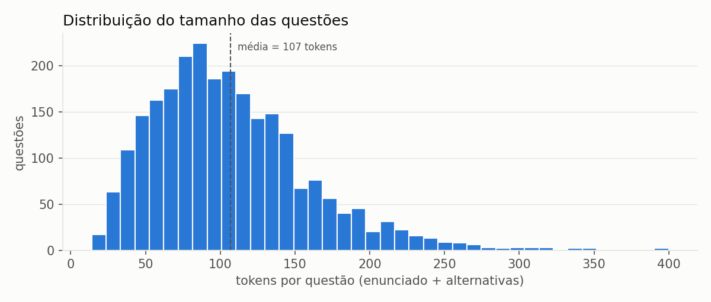
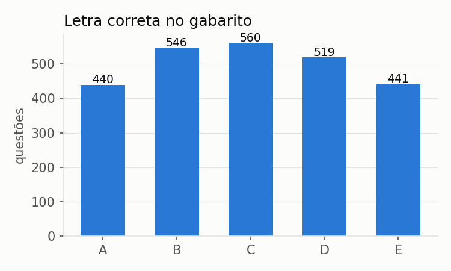

# Estatísticas do corpus

| Medida | Valor |
|---|---:|
| Provas utilizadas | 95 |
| Questões extraídas dos PDFs | 6777 |
| Questões no corpus | 2506 |
| Questões descartadas | 4271 |
| Total de tokens | 267.403 |
| Total de types | 16.988 |
| Razão type/token | 0.0635 |
| Tokens por questão (média ± dp) | 106.71 ± 52.61 |
| Tokens por questão (mediana) | 98.5 |
| Maior questão | 400 tokens (56-044) |
| Menor questão | 14 tokens (94-044) |
| Tokens no enunciado (média) | 66.77 |
| Tokens por alternativa (média) | 8.01 |
| Questões com 5 / 4 alternativas | 2478 / 28 |
| Qualidade léxica (tokens reconhecidos em dicionário pt+en) | 94.2% |

## Por subárea

| Subárea | Questões | % | Tokens | Types | Tokens/questão (média) |
|---|---:|---:|---:|---:|---:|
| Eng. Software e Programação | 758 | 30.2 | 80172 | 8517 | 105.77 |
| Redes e Infraestrutura | 664 | 26.5 | 70366 | 7533 | 105.97 |
| Segurança da Informação | 507 | 20.2 | 57259 | 6483 | 112.94 |
| Banco de Dados e Ciência de Dados | 459 | 18.3 | 46167 | 6046 | 100.58 |
| Governança e Gestão de TI | 118 | 4.7 | 13439 | 2293 | 113.89 |

## Subárea × ano

| Subárea | 2021 | 2022 | 2023 | 2024 | 2025 | 2026 | Total |
|---|---:|---:|---:|---:|---:|---:|---:|
| Eng. Software e Programação | 39 | 79 | 152 | 278 | 132 | 78 | 758 |
| Redes e Infraestrutura | 28 | 79 | 168 | 279 | 85 | 25 | 664 |
| Segurança da Informação | 16 | 67 | 97 | 233 | 56 | 38 | 507 |
| Banco de Dados e Ciência de Dados | 16 | 48 | 120 | 177 | 80 | 18 | 459 |
| Governança e Gestão de TI | 1 | 18 | 26 | 50 | 19 | 4 | 118 |
| **Total** | 100 | 291 | 563 | 1017 | 372 | 163 | 2506 |

## Termos mais frequentes por subárea (sem stopwords)

- **Eng. Software e Programação**: código, software, desenvolvimento, dados, sistema, testes, projeto, web, uso, classe, requisitos, equipe, aplicação, função, execução
- **Redes e Infraestrutura**: rede, dados, servidor, sistema, protocolo, redes, nuvem, sistemas, camada, modelo, internet, tcp, serviços, acesso, empresa
- **Segurança da Informação**: segurança, dados, informação, acesso, rede, pessoais, chave, sistema, riscos, proteção, autenticação, criptografia, tratamento, empresa, sistemas
- **Banco de Dados e Ciência de Dados**: dados, banco, from, select, tabela, sql, bancos, where, data, tipo, comando, sistema, tabelas, create, modelo
- **Governança e Gestão de TI**: serviços, processos, projeto, projetos, serviço, gerenciamento, gestão, informação, processo, itil, tecnologia, organização, governança, negócio, cobit

## Distribuição do gabarito

| A | B | C | D | E |
|---:|---:|---:|---:|---:|
| 440 | 546 | 560 | 519 | 441 |

## Motivos de descarte (uma questão pode ter mais de um)

| Motivo | Questões |
|---|---:|
| fora_de_computacao_secao | 3159 |
| fora_de_computacao_sem_termos_de_TI | 586 |
| duplicada | 254 |
| fragmento_solto | 231 |
| alternativa_com_texto_extra | 103 |
| sem_gabarito | 80 |
| depende_de_texto_de_outra_questao | 66 |
| depende_de_imagem | 55 |
| questao_anulada | 53 |
| alternativa_vazia | 23 |
| questoes_mescladas | 19 |
| simbolo_nao_convertido | 19 |
| alternativas_incompletas | 5 |
| enunciado_curto | 4 |
| caracteres_estranhos | 4 |

## Gráficos

